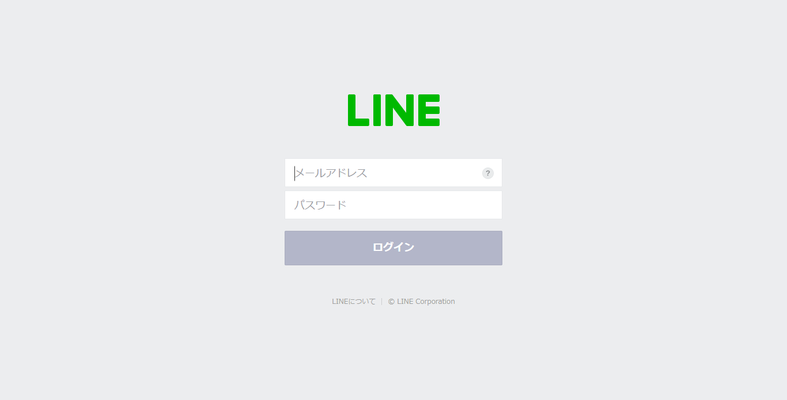
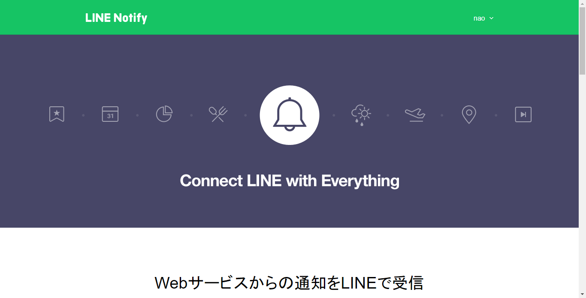
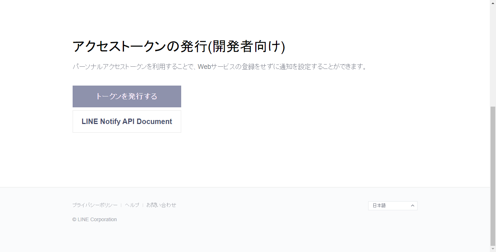
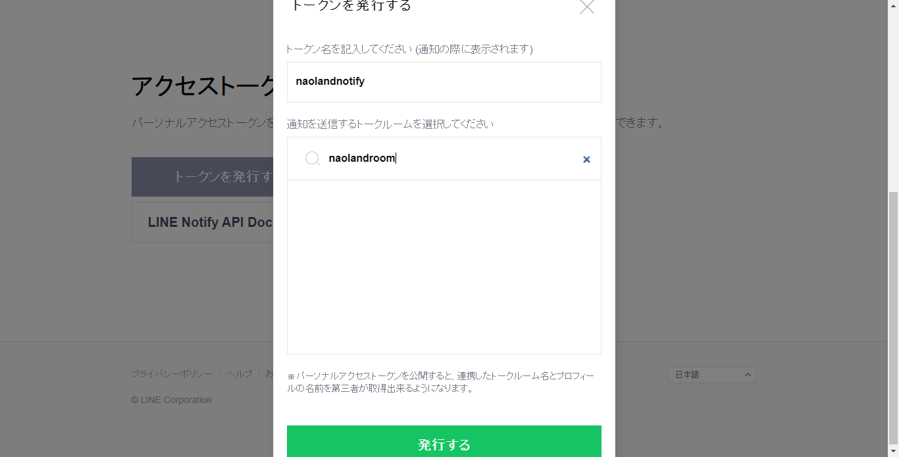
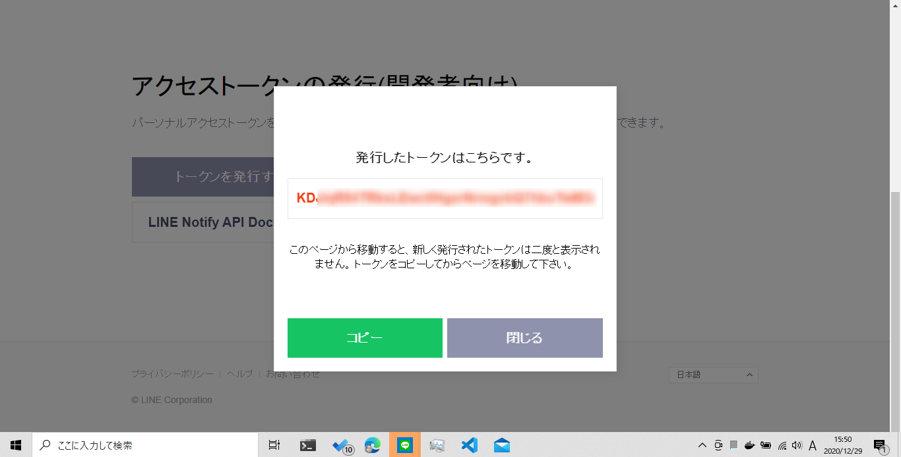
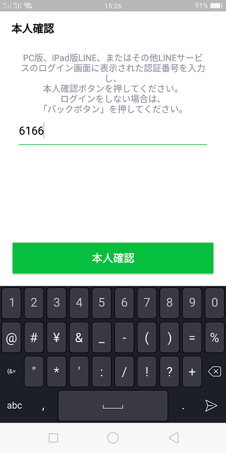
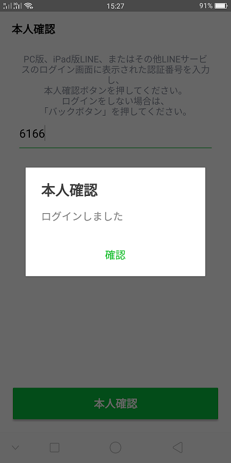
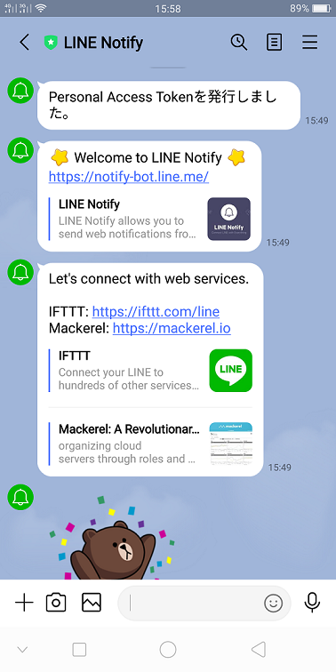

# 簡単プログラミング！ LINEに通知できる準備をしよう

みなさん、こんにちは。もう年末年始ですね。新型コロナ感染に気を付けつつ、楽しい年末年始をお迎えください。

## はじめに

今回は次回以降で使用するLINE通知（LINE Notify）の準備を行います。そして次回の記事ではPythonまたはGo言語を使ってXEMの現在価格を取得し、その内容をLINEに通知してみたいと思います。

LINEのアカウントは持っていることが前提です。もしなければ新規に作成してください。説明は割愛します。ググってください。

作業の流れとしては、

1. LINE Notifyにアクセス（必ずPCのブラウザからアクセスしてください）
1. ご自身のlineアカウントでログイン
1. トークンの設定と発行
1. トークンの取得と保存
1. LINEアプリ（スマホ）での本人確認
1. LINE Notifyからのメッセージ確認

というステップになります。

## LINE通知とは

サービスの正式名称は「LINE Notify」。

公式サイトによると、

- Webサービスからの通知をLINEで受信
- Webサービスと連携すると、LINEが提供する公式アカウント"LINE Notify"から通知が届きます。
- 複数のサービスと連携でき、グループでも通知を受信することが可能です。

と説明されています。

プログラムから、自分や自分のグループにだけに通知メッセージを送ったりすることもできるようです。

今後の記事で、オリジナルの通知ができる実行ファイル（.exeなど）の提供も企画してます。また他のサービスとの連携方法の紹介も行う予定です。

## 手順

PCのブラウザから、 https://notify-bot.line.me/ja/ にアクセスします。
次のような画面が表示されたら、右上の「ログイン」をクリックします。

LINEで使っているメールアドレスとパスワードを入力し、ログインボタンをクリックします。

右上に自分のユーザ名が表示されるのでクリックして「マイページ」を選択します。

「トークンを発行する」ボタンをクリックします。

トークンを発行する画面が表示されるので、トークン名を記入、通知を行わせるトークルームを選択し「発行する」ボタンをクリックします。
発行ボタンをクリックすると、トークンの確認画面が表示されるとともに、スマホのLINEアプリへ本人確認のメッセージが届きます。

発行されたトークンが表示されます。コピーボタンをクリックし、「line-notify-accesstoken.txt」などという名前のテキストファイルなどに保存してください。ファイル名は自由にお決めください。
nemlogワレットのプライベートキーと同じように、大切に保管してください。

本人確認を行ってください。

本人確認が完了すると、次のようなトークン発行完了メッセージがLINE Notifyから届きます。

以上で「Line Notify」を利用した通知を行う準備ができました。

## まとめ

LINE Notifyを使うためのトークン発行は簡単でしたね。

自分で作ったプログラムや他のサービスからLINEに通知を送るための準備が完了しまた。

次回以降では、このトークンを利用して、LINEに通知を送ったりするプログラムをご紹介していく予定です。

## 関連情報へのリンク

- [LINE Notify](https://notify-bot.line.me/ja/)
- [簡単プログラミング！ LINEに通知できる準備をしよう](https://nemlog.nem.social/blog/53471)
- [nemlog記事とプロフィール](https://nemlog.nem.social/profile/5648)
- [nemlog投稿管理用リポジトリ](https://github.com/naoland/nemlog-posts)
